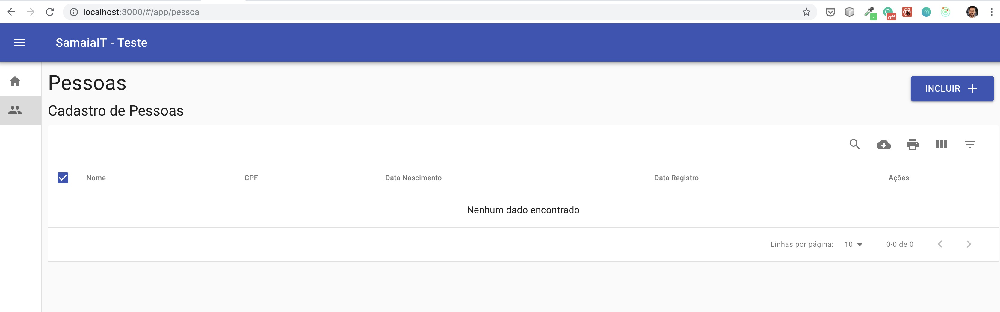
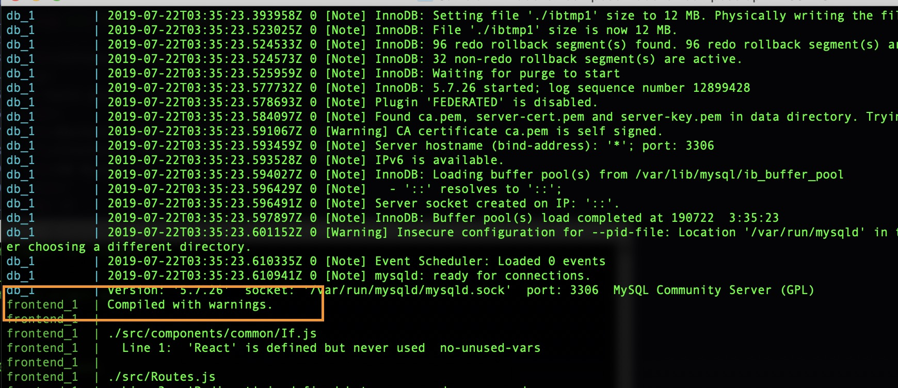

[![LinkedIn][linkedin-shield]][

<p align="center">
  <h2 align="center">Teste Samaia IT</h2>
</p>
<p>
<b>Autor:</b> Caio Siqueira<br />
<a href="https://www.linkedin.com/in/caiosiqueira/">linkedin.com/in/caiosiqueira</a>
</p>



<h3>Informações</h3>
<p>
O teste possui 3 partes:
<ul>
<li><a href="https://github.com/caiocesarss/stestbackend">Backend - Node JS (Express, Knex)</a></li>
<li><a href="https://github.com/caiocesarss/stestfrontend">Frontend - React JS (Material UI, Redux)</a></li>
<li><a href="https://github.com/caiocesarss/stestmain/tree/master/db">DB Mysql (dump sql incluso)</a></li>
</ul>
<br />
Foi desenvolvido para ser executado em Docker, usando docker-compose. 
</p>
<h3>
Instruções para build:
</h3>
<p>
No diretório raiz, executar o comando:
```sh
docker-compose up
```
O build irá iniciar. Aguardar a conclusão (em torno de 5-10 min). A imagem abaixo mostra os comandos finais indicando que a aplicação foi iniciada.
<br />

</p>
<p>
O app posui um menu lateral, onde deve ser escolhido a opção "pessoas". 
</p>
<h4>Requisitos solicitados no teste, conform e-mail:</h4>
<p>
Criar um CRUD que mantenha o cadastro de uma Pessoa Fisica com os campos: <br />
Id (auto incremento)<br />
Nome<br />
CPF (com validação de CPF)<br />
E-mail<br />
Data de Nascimento<br />
Data do cadastro (campo interno de sistema preenchido automaticamente com a data atual no momento da inclusão)<br />
Lista de Endereços<br />
- Logradouro<br />
- CEP<br />
- Bairro<br />
- Cidade<br />
- UF<br />
Lista de Telefones<br />
-Telefone (com mascara e validação de 8 e 9 dígitos no telefone)<br />
 

Para camada de persistência podem ser utilizadas as linguagens (Java ou NodeJS) e para o Front-end Angular/Vue/React. <br />
A escolha das linguagens fica a critério do candidato.<br />
É obrigatório usar a arquitetura de microsserviços e conceito de Single Page Application.<br />
A solução deve ser entregue funcionando no Docker<br />
Também devem ser entregues: <br />
a) Script de banco de dados para criação de tabelas<br />
b) todo código fonte produzido no GitHub, o qual será avaliado quanto a sua clareza, objetividade e padrões seguidos.<br />
c) Documentação para execução do código produzido.<br />
</p>
